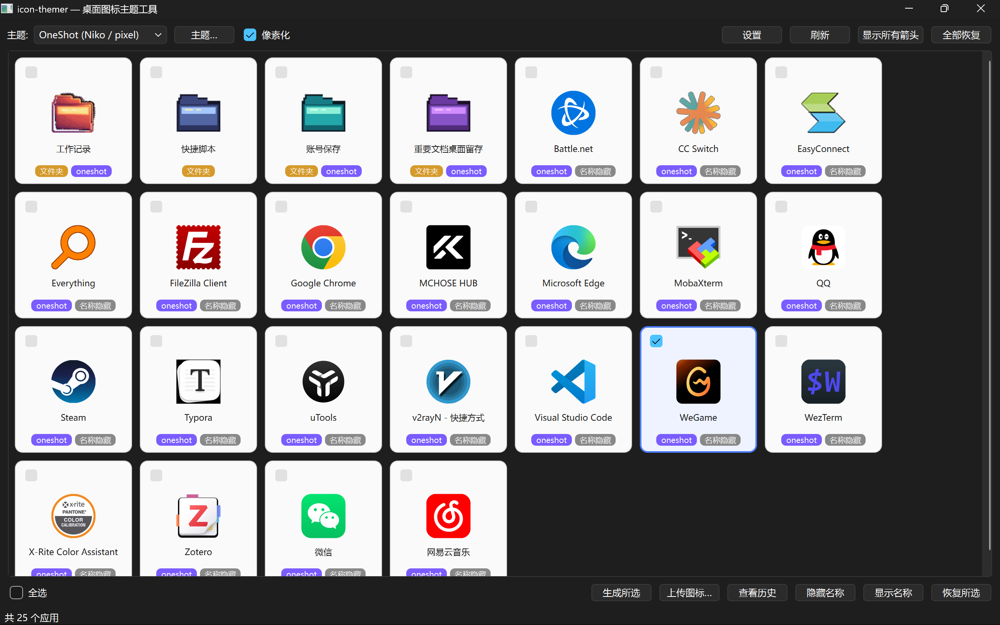
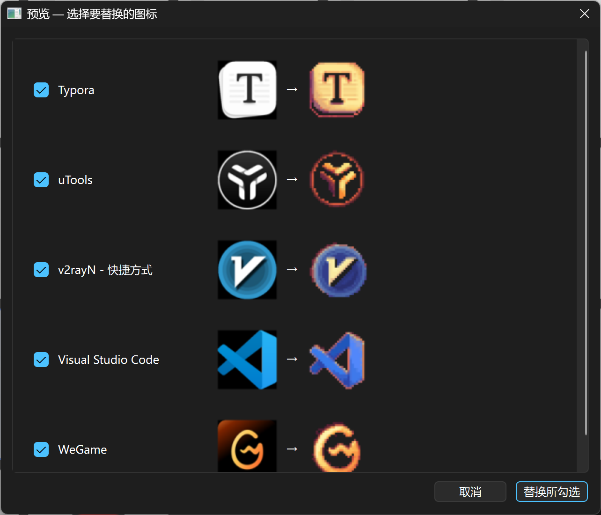
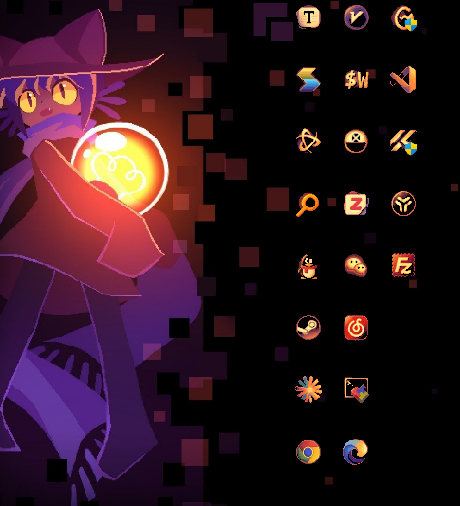

# icon-themer

一个 Windows 桌面 GUI 工具：用图像生成模型把桌面上的**快捷方式和文件夹图标**批量重绘成统一画风
（内置 OneShot 像素风主题），让桌面整体协调好看。全程**可逆**——随时一键恢复原图标和原名称。
可支持自定义主题，也可通过上传桌面背景等图片，由图文模型生成主题！

### 主界面



### 预览替换



### 桌面效果



## 它能做什么

- **自动扫描桌面项目**：启动后列出桌面上的快捷方式和文件夹，不需要手动维护应用列表。
- **批量生成统一风格图标**：选择多个项目后，用图像模型按当前主题重绘图标，适合一次性整理整张桌面。
- **替换前预览对比**：应用前先展示「原图标 → 新图标」，确认效果后再真正写入快捷方式或文件夹。
- **保留原始图标用于辨认**：主页卡片始终显示项目的真实原始图标，不会因为已经主题化或隐藏名称而变得难认。
- **支持像素化后处理**：可把模型输出处理成真正的像素网格，也可以关闭像素化保留高清图标。
- **支持自定义图标上传**：可以跳过模型生成，直接把本地图片转换并套用为 Windows 图标。
- **管理主题配置**：可以新增、编辑、删除主题，也可以从壁纸生成一套主题提示词。
- **保存生成历史**：每次生成都会归档，可回看某个应用以前的图标，并重新套用旧版本。
- **清理桌面显示**：支持隐藏快捷方式名称、隐藏快捷方式箭头，让桌面只保留图标视觉。
- **一键恢复原状**：可以恢复图标、名称和快捷方式箭头，降低批量修改桌面的风险。

## 工作原理

```
扫描桌面 → 取应用当前图标 → 图像模型重绘(保留识别度,只换画风)
        → (可选)像素化后处理: 降采样 + 限色 + 硬边 → 多尺寸 .ico → 套用到快捷方式/文件夹
```

- **画风完全抽象进 `themes/*.json`**（`base_prompt` + 调色板 + 像素参数），换 IP 只改主题文件，代码不动。
- 生成默认走 **img2img**：把应用真实图标喂给模型，所以陌生软件也能忠实重绘；失败自动回退文生图。
- 像素感主要由**本地后处理**保证（降采样到 N×N + 调色板量化 + 最近邻放大），不只靠模型。

## 环境要求

- **Windows 10 / 11**（依赖 PowerShell / 注册表 / COM / `desktop.ini`，仅 Windows 可用）。
- **Python 3.10+**（推荐用 Conda 创建独立环境）。
- 启动时会**自动请求管理员权限（UAC）**——改公共桌面快捷方式、写图标缓存需要。
- 一个**兼容 OpenAI 接口的图像生成 / 编辑服务**（`images.generate` / `images.edit`），需自备 `base_url`、`api_key`、`model`。

## 安装

```powershell
conda create -n icon-themer python=3.10 -y
conda activate icon-themer
pip install -r requirements.txt
```

之后每次运行前先进入环境：

```powershell
conda activate icon-themer
```

## 配置（首次必做）

运行后点右上角 **设置**，填写「图片生成 / 编辑」：

- **Base URL**：你的 OpenAI 兼容接口地址（如 `https://api.openai.com/v1` 或自建中转）。
- **API Key**：对应的密钥。
- **模型**：能出图的模型名，例如 `gpt-image-1`。
  （仓库默认值 `gpt-image-2` 是作者私有中转里的名字，**别人用要换成自己服务支持的模型**。）
- **启用图片编辑接口**：开 = img2img 优先（重绘更像原图），不可用时自动回退文生图。

点**保存**后会写入项目根目录的 `settings.json`，**下次启动自动读取**；之后再改也会写回该文件。
`settings.json` 仅存在本地、含明文密钥，已被 `.gitignore` 忽略，不会进版本库。

> 也支持不填设置、走回退：环境变量 `OPENAI_API_KEY` / `OPENAI_BASE_URL`，或本机 Codex CLI 配置
> （`~/.codex/auth.json` + `~/.codex/config.toml`）。「从壁纸生成主题」用的**视觉模型**需在设置里单独配（必填模型名）。

## 运行

```powershell
python app.py
```

流程：勾选应用 → （可选）切主题、勾「像素化」→ **生成所选** → 预览对比 → 确认替换。不满意就**全部恢复**。

## 主题

`themes/oneshot.json` 示例：

```json
{
  "name": "oneshot",
  "display_name": "OneShot (Niko / pixel)",
  "size": "1024x1024",
  "pixel_art": { "enabled": true, "source_size": 32, "colors": 32 },
  "base_prompt": "Pixel art app icon drawn in the exact visual style of ..."
}
```

- `pixel_art.enabled` 决定该主题默认是否像素化（GUI 里的「像素化」勾选框默认跟随它，可手动覆盖）。
- `source_size` = 降采样网格边长，`colors` = 限色数。
- 新建主题只要写一个新的 `base_prompt`（和可选调色板 / 像素参数）即可。

## 说明 / 注意

- **仅 Windows**：图标套用依赖 Windows 专有机制。
- **密钥只在本地**：`settings.json` / `state.json` 均被忽略，不入库。
- 没配置任何可用 API 时，生成会报错并提示去「设置」。
- 文件夹图标有时要等 Windows 图标缓存刷新后才显示（必要时重启资源管理器）。
- 主页卡片显示的是**原始图标**（按当前屏幕缩放做清晰缩放，不模糊）；想确认主题/像素效果请用「预览」或「查看历史」。

目前项目还有很多不完善的地方~欢迎 Star、提 Issue、贡献主题 JSON哦，也欢迎各位来l站的帖子交流：https://linux.do/u/despriber/summary
